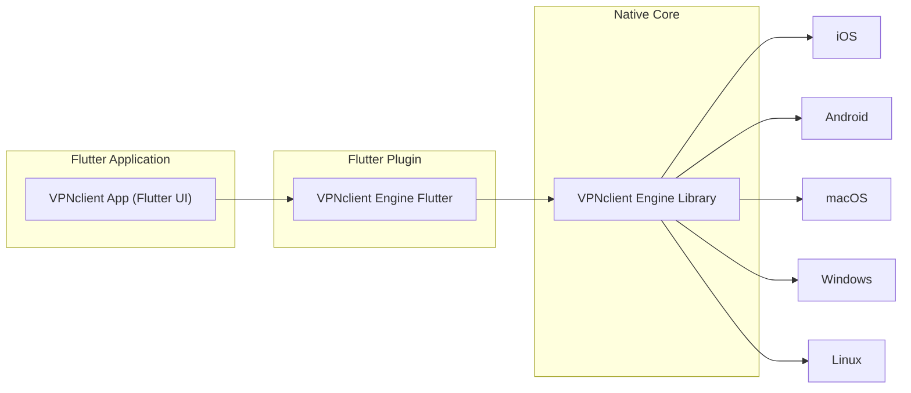

# VPNclient App

**VPNclient App** is a cross-platform, open-source VPN client application built with Flutter. It provides a unified user interface for managing VPN connections on multiple platforms using advanced VPN protocols. The app combines a Flutter-based **UI** with the native **VPNclient Engine** core, supporting protocols from **Xray** (VMess, VLESS, Reality) to **WireGuard** and **OpenVPN**. Its purpose is to offer end users a fast, intuitive, and flexible VPN client, while allowing developers and VPN providers to customize or integrate it into their own solutions.

### 🚀 Key Features

- **Multi-Protocol VPN Support:** Connect to VPN servers using **Xray** protocols (VMess, VLESS, Reality) as well as **WireGuard** and **OpenVPN**. This allows accessing both traditional VPNs and modern proxy/VPN hybrids in one app. OpenVPN support is planned via the engine, ensuring compatibility with existing servers.
- **Cross-Platform Consistency:** Built with Flutter for a uniform experience on mobile (iOS 15+ and Android 6.0+) and desktop (Windows, macOS, Linux). The interface and functionality remain consistent across platforms, reducing learning curve and support issues.
- **User-Friendly Interface:** Intuitive UI with a single toggle to connect/disconnect, server selection, and real-time status. The app displays connection status, server location, and basic statistics (speed, data usage) for transparency and ease of use. *[TODO: Screenshot of main interface here]* 
- **Server Subscription Management:** Easily import or update server lists via subscription URLs (e.g. VPN profiles in XRAY/V2Ray/sing-box format). Users can add a subscription link to fetch multiple server configs at once, rather than entering servers one by one.
- **Custom Routing Rules:** Fine-tune how traffic is handled. For example, route specific apps or domains through the VPN, allow others to bypass, or block certain domains entirely. This enables split-tunneling (only proxy certain traffic) and ad/tracker blocking configurations.
- **Security Features:** Includes an optional **Kill Switch** (to block internet if the VPN connection drops unexpectedly) and **Auto-Connect** (to automatically connect on app launch or network change). These ensure continuous protection without manual intervention.
- **No Root or Jailbreak Required:** On Android, VPNclient App uses the Android VPN Service API, so it does not require root access. On iOS, it leverages the Network Extension framework with the built-in VPN entitlements. All traffic is tunneled securely without system modifications.

### 📦 Architecture Overview

VPNclient App is architected in layers to separate the user interface from core VPN logic:

- **Flutter UI (Dart):** Implements all screens and user interactions (server list, connect button, settings, etc.). This layer is platform-independent and handles input/output with the user.
- **VPNclient Engine Flutter Plugin:** A Flutter plugin (package) that serves as a bridge between the Dart UI and the native engine. The app calls high-level methods (e.g. connect, disconnect, load subscription) on this plugin, which in turn communicates with the native engine. This plugin is used as a dependency of the app.
- **VPNclient Engine (Native Core):** The underlying C++ core that actually handles VPN functionality. It manages network tunnels, encryption, and protocol implementations. The engine integrates multiple VPN implementations (Xray, WireGuard, OpenVPN, etc.) and network drivers (TUN/TAP, proxies) under a common API. The engine runs natively on each platform for performance.



*Diagram: The Flutter UI calls into the VPNclient Engine via a Flutter plugin. The native engine runs on each supported platform (iOS, Android, etc.), handling low-level network operations.* 

This modular design makes it easy to maintain and extend. UI/UX changes can be made in Flutter without affecting the core, and the engine can be updated independently to support new protocols or optimizations. For potential partners, the separation means you can **re-skin or customize the app** (UI layer) while relying on a proven engine core, or integrate the engine into your own app with a custom UI.

## 🛠 Installation and Getting Started

There are two ways to get VPNclient App:

**1. Install a Pre-built Release (End Users):**  
VPNclient App is in active development and available in beta form:
- **Android:** Download via Google Play [VPNclient on Google Play](https://play.google.com/store/apps/details?id=vpnclient.click) (or join the testing program). Requires Android 6.0 or higher.
- **iOS:** Download via App Store – [VPNclient on App Store](https://testflight.apple.com/join/KQr4SeS7). Requires iOS 15.6 or higher.  

After installing, simply launch the app. On first launch, you may be prompted to accept VPN permissions (Android) or install a VPN profile (iOS) – these are required to create the VPN tunnel.

**2. Build from Source (Developers):**  
If you want to try the latest version or modify the app, you can build it yourself:

- **Prerequisites:** Install Flutter (Flutter 3 or later recommended) and Dart SDK on your system. Ensure you can run `flutter` commands and have setup Flutter for your target platforms (e.g. Xcode for iOS, Android SDK for Android).
- **Clone the Repositories:** This app depends on the VPNclient Engine Flutter plugin. Clone the following repository from GitHub:
  ```bash
  git clone https://github.com/VPNclient/VPNclient-app.git
  ```
- **Get Dependencies:** Navigate into the `VPNclient-app` directory and run:
  ```bash
  flutter pub get
  ```
  This will fetch Flutter packages and link the local plugin.
- **Platform Setup:**  
  - For **Android**, ensure you have an Android device/emulator and the Android SDK. The app uses the VpnService API; no additional setup is required except granting VPN permissions when prompted.  
  - For **iOS**, open the Xcode workspace (`ios/Runner.xcworkspace`) and **enable the “Personal VPN” capability** in the project (this automatically updates entitlements). Also, in `ios/Runner/Info.plist`, ensure the required VPN usage descriptions are present (the engine may use a custom key such as `allow-vpn`). You will need a valid Apple Developer Team provisioning for running VPN entitlements on device.  
  - For **macOS/Windows/Linux**, additional setup may be needed (e.g., on Windows, the `wintun` driver should be present; on Linux, you might need root or capabilities to create a TUN interface). Desktop support is experimental and may require manual configuration.
- **Run the App:** Use Flutter CLI to run on your desired platform:
  ```bash
  flutter run
  ``` 
  This will launch the app on an emulator or connected device. You can also build release APKs or app bundles using `flutter build apk` / `flutter build appbundle` (Android) or an IPA (iOS) with Xcode. For desktop, `flutter run -d macos` or `-d windows` can be used if enabled.

*Note:* The repository includes helper shell scripts (`build_android.sh`, `build_ipa.sh`, etc.) which automate some build steps for CI or local packaging.

## Usage Guide

Once the VPNclient App is installed and running, using it is straightforward:

- **Adding Servers:** If you have a subscription URL from your VPN provider (for example, a V2Ray/Xray subscription link that lists multiple servers), you can add it in the app. Navigate to **Subscriptions** or **Servers** section (depending on the UI labels) and enter the URL. The app will fetch and parse the server list automatically. You can also add a single server manually by entering its details (protocol, address, port, user ID, etc.) if you prefer not to use a subscription link.
- **Server List:** After adding, your servers will appear in a list, showing information like server location or name, and possibly latency. You can tap a server to select it. There may be an option to **ping** servers to measure latency; if so, use it to find the fastest server for your location. *(For example, a server list might show each server’s country flag and ping time – [screenshot here] – helping you choose.)*
- **Connecting:** On the main screen, tap the **Connect** button (often a large toggle or icon). The first time, your device will ask for VPN connection permission – accept it. The app will then initiate the connection using the selected server and protocol. Within a few seconds, you should see the status change to "Connected", along with a key icon on your status bar (mobile) indicating an active VPN.
- **During Connection:** While connected, the app may show real-time stats such as upload/download speeds and total data used this session. It will also indicate the current server name or IP. If any error occurs (e.g., invalid credentials or network unreachable), the app will display an error message.
- **Routing Rules:** If you want to customize which traffic goes through the VPN, go to the **Settings** or **Routing** section. Here you can add rules. For example:
  - Route specific apps through VPN (e.g., route your web browser and video apps through the VPN for privacy, but let banking apps go direct).
  - Route or block specific domains (e.g., send `*.example.com` through VPN or block `ads.example.net`).  
  Set your desired rules and save. The VPNclient Engine will enforce these rules when connected.
- **Disconnecting:** To stop the VPN, tap the **Disconnect** button. The status will change to "Disconnected" and your internet traffic will resume normal direct routing. You can reconnect at any time by tapping Connect again.
- **Auto-Connect & Kill Switch:** In settings, you may enable **Auto-Connect** so that the app automatically connects to the last used or a preferred server on startup or when it detects internet connectivity. Enabling the **Kill Switch** ensures that if the VPN drops, the app will block all internet traffic until the VPN is reconnected (preventing leaks). Use these features if you require always-on protection.
- **Profiles and Configs:** If you use multiple VPN profiles (for example, personal VPN vs. work VPN), you can manage them via separate subscription links or configuration import. The app can handle multiple profiles – they will be listed separately. Select the profile or server group you want before connecting.

Overall, VPNclient App is designed to require minimal configuration for end users: add a subscription or server, then connect with one tap. Advanced users or partners can customize the experience through the above features. *[TODO: Add screenshot of settings or routing rules here]*.

## 📄 License

This project is licensed under the **VPNclient Extended GNU General Public License v3 (GPL v3)**. See [LICENSE.md](./LICENSE.md) for the full license text and additional terms. 

⚠️ *Note:* The "extended GPL v3" license includes additional conditions (in accordance with GPLv3 Section 7) specific to the VPNclient project. By using or distributing this software, you agree to comply with these additional terms as well. 

## 📬 Support and Contact

- **Issues and Bugs:** If you encounter a bug or have a question, please open an issue on the [GitHub issue tracker](https://github.com/VPNclient/VPNclient-app/issues). We aim to respond and address issues promptly. Before opening a new issue, you can search existing ones in case it’s already reported or resolved.
- **Discussion and Help:** For general discussion or usage questions, you can also reach out via our official Telegram channel [VPNclient on Telegram](https://t.me/vpnclient_chat) for community support, or check the [project wiki/docs](https://vpnclient.click) for guides.
- **Partners/Business Inquiries:** If you are interested in using VPNclient App as part of your product or need custom development/branding, please contact us through the [contact form](https://vpnclient.click/contacts) or via email (see Contacts on the website). We are open to partnerships and can provide services to tailor the app to your needs.

---

*VPNclient App is part of the **VPNclient project**, which also includes the [VPNclient Engine Flutter plugin](https://github.com/VPNclient/VPNclient-engine-flutter) and the [VPNclient Engine core](https://github.com/VPNclient/VPNclient-engine). Be sure to check them out for more information on how the system works under the hood.*
